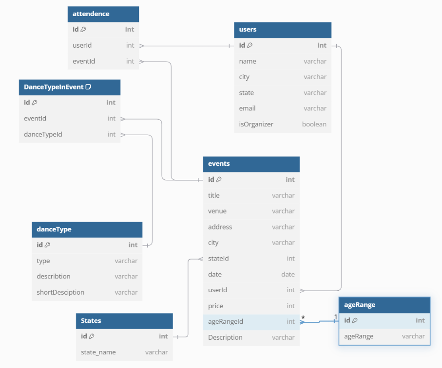

# Dance Finder

<b style="font-size: 20px;"><i>Place to connect you and your dancing needs</i></b>

### Application Overview
This application aims to centralize and simplify the discovery of Latin dance events by providing a platform where event organizers can easily publish their gatherings, and dancers can effortlessly find local events anywhere. By eliminating the need for closed social media groups or personal connections, it will make the vibrant world of Latin dance more accessible to everyone, including travelers and those new to the scene.

## Features

<p>
• All users can see sort and search all event listed by various organizers.<br>
• All users can see organizer details and read more about specific dance types.<br>
• Organizers can create/edit/delete events.<br>
• Dancers can mark their attendance and see event list they are attending .
</p>

## Technologies Used

       

## Installation Instructions 

1. Clone this repository and change to the directory in the terminal. cd into the directory that was created and run one npm commands(run following commands one at the time).
```sh
git clone git@github.com:EditaAdomaityte/DanceFinder.git
cd DanceFinder
npm install
npm start
```
2. Access the data. In a new terminal
```sh
cd DanceFinder/dancerapi
json-server -p 8088 database.json       
```


### ERD



### Wireframe

Take a few minutes to check out the  [Dance Finder wireframe](https://miro.com/app/board/uXjVLr0KUSg=/?share_link_id=594503928356)

#### Created by Edita Adomaityte

<a href="https://github.com/EditaAdomaityte" target="_blank"></a> <a href="www.linkedin.com/in/edita-adomaityte" target="_blank"></a>